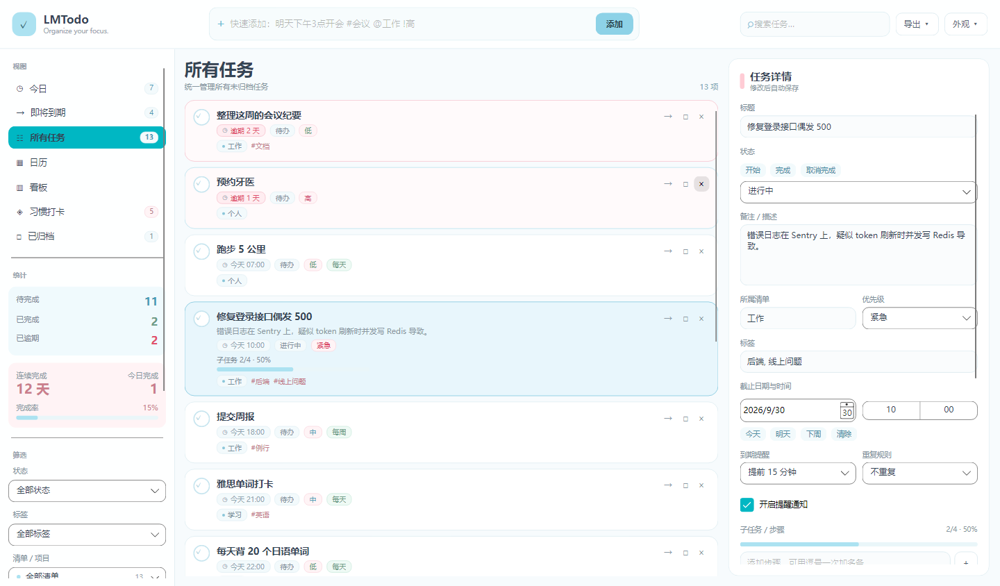
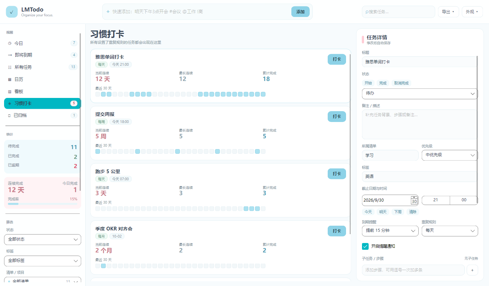
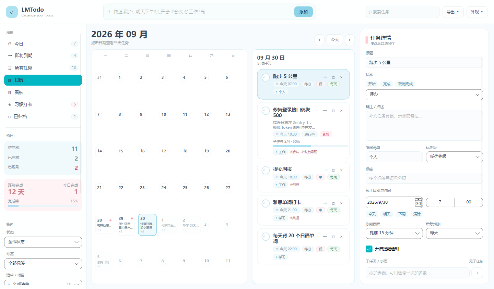
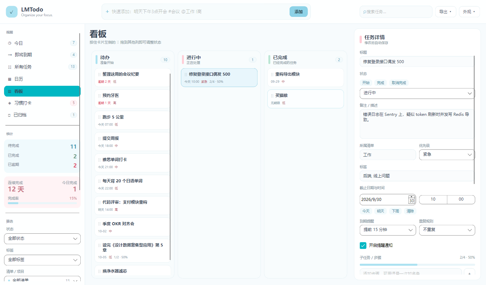
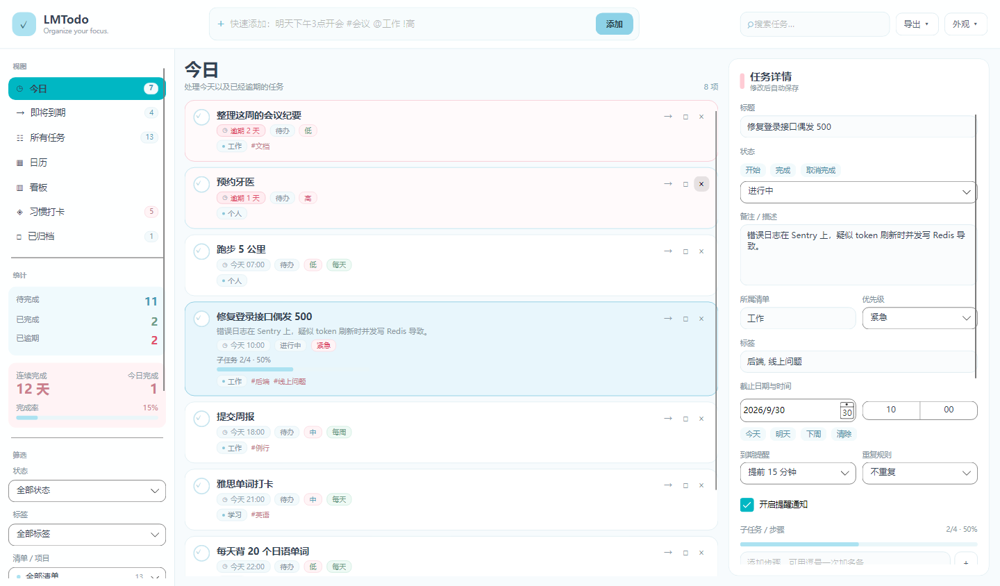
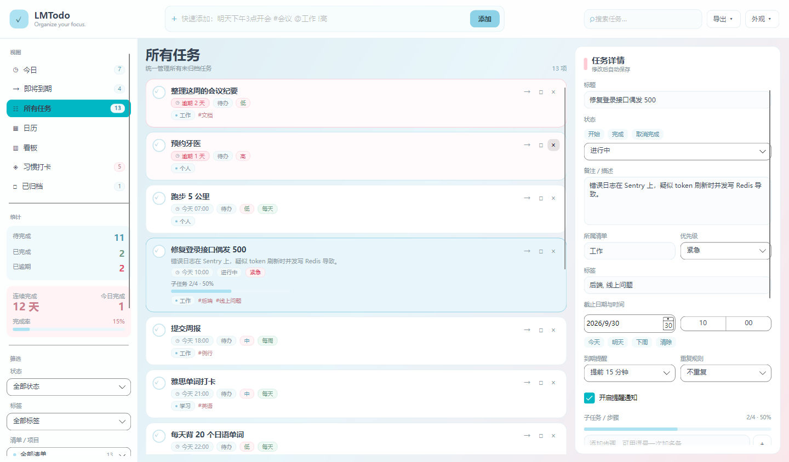

# LMTodo

基于 Avalonia 的桌面待办应用--增删改查以及「自然语言快速录入」「周期任务的连续打卡统计」「多视图切换（列表 / 日历 / 看板拖拽）」等功能.

技术栈：.NET 10 · Avalonia 12.1.3 · CommunityToolkit.Mvvm 8.4.2 


---

## 截图

**所有任务** — 逾期标红、优先级与标签、子任务进度条、右侧详情面板



**习惯打卡** — 连续天数按周期单位自动切换（天 / 周 / 个月），30 天打卡点阵



**日历** — 月视图带任务预览与逾期标记，右侧列出当天任务



**看板** — 三列按状态分组，卡片可拖拽改变状态，左上角 `⋮⋮` 为拖拽把手



**今日** — 今日 + 已逾期任务



**自定义壁纸** — 顶栏「外观」可选取本地图片作为背景，覆盖 80% 白纱保证正文对比度



---

## 快速开始

环境要求：**.NET 10 SDK**（Windows / macOS / Linux 均可）

```bash
git clone <this-repo>
cd LMTodo
dotnet run
```

首次运行会自动创建数据目录 `%LOCALAPPDATA%\LMTodo\`（macOS/Linux 对应 `~/.local/share/LMTodo/`）。

(数据文件 `tasks.json` 在第一次保存时生成，所以全新环境启动后看到的是空列表而不是报错)

发布独立可执行文件：

```bash
dotnet publish -c Release
```

---

## 功能

### 任务管理

- **创建**：标题、备注、截止日期与时间、优先级（紧急 / 高 / 中 / 低）、多标签、所属清单、重复规则、提前提醒
- **状态**：待办 → 进行中 → 已完成；支持取消完成、归档、删除
- **组织**：清单（可自定义颜色）、标签、负责人

### 快速添加（自然语言）

顶部输入框回车即建，可任意组合以下写法：

| 输入 | 解析结果 |
| --- | --- |
| `明天下午3点开会` | 标题「开会」+ 截止明天 15:00 |
| `每周一 上午10点 周会 提前30分钟提醒` | 重复 + 时间 + 提醒 |
| `9/30 交论文 [查资料][写大纲] //找导师签字` | 截止日期 + 2 条子任务 + 备注 |
| `3天后 复盘 每天` | 相对日期 + 重复规则 |
| `下周三 下午2点半 面试 紧急` | 自然语言日期 + 优先级 |
| `写周报 #工作 @例会 !高` | 标签 + 清单 + 优先级 |

支持的语法：

日期（今天 / 明天 / 后天 / 大后天 / 周几 / 下周几 / N 天后 / M月D日 / M/D）

时间（上午 / 下午 / 晚上 / 几点半 / 几点几分 / HH:MM）

优先级（`!紧急` `!高` `!中` `!低`、`!` ~ `!!!!`、`!1` ~ `!4`）

标签 `#tag`、清单 `@list`、子任务 `[步骤]`

备注 `//` 或 `::`、重复规则、提前提醒。

输入框下方实时显示解析预览，按 Enter 前就能看到会被识别成什么。

### 多视图

- **今日 / 即将到期 / 所有任务 / 已归档** — 列表视图，共用同一套卡片模板
- **日历** — 月视图，格子内显示任务预览与逾期标记，点击日期查看当天任务
- **看板** — 按状态分三列，拖拽卡片即可改状态
- **习惯打卡** — 只列重复任务，显示当前连续、历史最长、累计完成和 30 天点阵

### 排序与筛选

4 种排序（截止时间 / 优先级 / 创建时间 / 标题），按状态、标签、清单筛选，外加全文搜索。侧边栏实时显示各状态计数和完成率。

### 到期提醒

- 可对单条任务设置「到点提醒」或「提前 N 分钟 / 小时 / 天」
- 到期与逾期分别用警告 / 错误级别的桌面通知
- 逾期任务在列表中标红
- 重复任务完成后按规则自动顺延到下一个周期

### 导出与备份

- **CSV** — Excel 可直接打开
- **ICS** — 导入 Google Calendar / Outlook
- **Markdown** — 纯文本归档
- **JSON 备份 / 恢复** — 恢复支持「合并」与「覆盖」两种模式

---

## 技术选型与理由

| 选择 | 理由 |
| --- | --- |
| **Avalonia** | 跨平台意味着可以在 macOS / Linux 上也能直接跑起来，不必迁就我的 Windows 环境 |
| **.NET 10** | 与 Avalonia 12 的配套版本；records / 模式匹配 / 集合表达式这些语法让解析和转换代码短很多 |
| **CommunityToolkit.Mvvm** | 用 source generator 生成 `INotifyPropertyChanged` 和命令样板，避免几千行手写的 `SetProperty` 噪音。`[ObservableProperty]` + `[RelayCommand]` 让 ViewModel 的内容基本只剩业务逻辑 |
| **System.Text.Json** | 框架内置，不引入第三方序列化依赖。对本地单文件存储够用 |
| **不用数据库** | 单用户桌面待办的数据量在千条量级，全量读进内存再整体写回的代价可以忽略。引入 SQLite 只会增加部署复杂度和一个原生依赖，收益不成正比。这个判断的前提是「单机单用户」，如果将来要做多端同步，可以重新评估 |
| **默认编译绑定** | 各视图声明 `x:DataType`，绑定路径在编译期校验。少数必须跨 `DataContext` 求值的绑定（如卡片模板里访问 ViewModel 的命令）用 `ReflectionBinding` 显式逃逸 —— 是例外而非常态 |

---

## 架构设计

### 分层

```
LMTodo/
├── Models/          纯数据模型 + 派生属性，不依赖任何 UI 类型
│   ├── ObservableModel.cs       INotifyPropertyChanged 的最小实现（SetField）
│   ├── TodoItem.cs              任务实体（876 行，含全部派生属性与行为）
│   ├── TaskList.cs / SubTask.cs / TaskComment.cs
│   └── AppSettings.cs
├── Repositories/    IO 边界：持久化、解析、导出
│   ├── ITodoRepository.cs       TodoStore 快照的读写契约
│   ├── JsonTodoRepository.cs    原子写 + 备份 + 损坏隔离
│   ├── QuickAddParser.cs        自然语言 → 结构化任务（839 行）
│   ├── ExportService.cs         CSV / ICS / Markdown
│   └── SettingsService.cs
├── Services/        无状态领域服务
│   └── ReminderService.cs       判定「此刻该提醒哪些任务」
├── ViewModels/      视图状态与命令
│   ├── MainWindowViewModel.cs           状态、属性、变更处理器（994 行）
│   ├── MainWindowViewModel.Queries.cs   筛选 / 排序 / 看板 / 月历 / 习惯（335 行）
│   ├── MainWindowViewModel.Commands.cs  全部用户操作（863 行）
│   └── UiModels.cs                      视图专用模型（不算业务实体）
├── Views/           只做三件事：文件对话框、拖拽、通知弹窗
│   ├── MainWindow.axaml                 （2,304 行）
│   └── MainWindow.axaml.cs              （494 行）
└── Converters/      枚举 → 中文文案、值 → 画刷
```

主 ViewModel 拆成三个 partial 文件（状态 / 查询 / 命令），是为了让单文件不失控，同时避免为了「文件小」而引入额外的服务层和跳转。这三个部分共享同一份字段，本质是一个对象。

### 数据流

```
用户操作
  └─ View 触发 Command
       └─ ViewModel 改 Model
            ├─ Model 在 setter 里 Touch()（更新 UpdatedAt 并通知派生属性）
            ├─ ViewModel 显式 RefreshEverything()（重算筛选 / 看板 / 月历 / 习惯）
            └─ ViewModel.Persist()（整体写回 JSON）
```

单向、无事件总线、无消息队列。刷新是显式的而不是自动的 —— 见下面的取舍说明。

### 关键设计决策

#### 1. 持久化：原子写 + 备份轮换 + 损坏隔离

`JsonTodoRepository.Save()` 的顺序是：写 `.tmp` → 把现有文件复制为 `.bak` → `File.Move` 替换。

- **为什么先写 `.tmp`**：直接覆盖原文件时，如果写到一半进程崩溃或断电，用户会拿到一个截断的 JSON —— 数据全丢。先写临时文件再原子替换，最坏情况是丢失本次改动，而不是整个文件。
- **为什么留 `.bak`**：用户误操作或程序 bug 导致数据异常时，还有一份上一次的快照可回退。
- **为什么损坏时不静默清空**：把损坏文件另存为 `tasks.corrupt-<时间戳>`，保留原始字节，同时把错误通过 `LastError` 冒到状态栏。静默回退到空列表会让用户以为「我的数据被程序删了」。保留现场是把定位问题的可能性留给用户。

这份实现还兼容早期版本的「裸数组」格式（直接存 `TodoItem[]` 而没有外层包装），读取时做了一次结构嗅探。这是为了说明存储格式演进时不会把旧数据读废。

#### 2. 派生属性代替冗余状态

`IsOverdue`、`DueShortLabel`、`SubTaskProgressLabel`、`CurrentStreak`、`HabitDays` 全部是算出来的（`[JsonIgnore]`），不落盘。

- **好处**：不存在「存了但忘了同步更新」的不一致。比如改 `DueDate` 只改一个字段，`IsOverdue` / `DueShortLabel` / `DaysOverdue` 自动跟着变。
- **代价**：每次批量变更后需要显式调用 `RefreshDerivedProperties()`，漏调就会看到过期数据。这个风险是真实存在的。
- **为什么还是这么选**：数据量小（千条量级），重算成本可忽略；而冗余字段一旦不一致，排查成本远高于漏调一次刷新。用「每次操作后统一刷新」的固定模式把漏调的概率压下来。

#### 3. 自然语言解析：跨度收集 + 事后裁剪

不用 `string.Replace` 逐个剔除识别到的片段，而是每匹配到一个模式就把它的 `[起点, 长度]` 记进 `cuts` 列表，最后一次性 `ApplyCuts` 剔除，剩下的就是标题。

- **为什么不用 `Replace`**：① 同一个词可能匹配多处，`Replace` 会全部换掉；② 多次替换会让后续匹配的位置全部失效；③ 用户标题里合法的 `#` 或 `@` 会被误伤（比如「C# 学习笔记」）。
- **为什么要做长度优先**：`大后天` 必须在 `后天` 之前匹配，否则「大后天」会被切成「大」+「后天」。日期关键词表按长度降序排列就是为这个。
- **优先级为什么接受三套写法**：`!紧急`（中文）、`!!!!`（感叹号个数）、`!1`~`!4`（数字）—— 用户的输入习惯差异很大，与其猜一个不如都支持，只要不产生歧义。

#### 4. 连续打卡按「周期」而非「天」计算

`CompletionDates` 存原始时间戳，计算时先投影到任务的周期（每天 / 每周 / 每月 / 每年），再在周期集合上取连续段。

- 所以「每周提交周报」连续 5 次显示的是 **5 周**，不是 5 天。
- 打卡去重也按周期做：同一天点两次不会变成两次打卡。
- 这是一个容易被忽略的正确性问题 —— 用「天」做单位实现起来更简单，但对「每周」「每月」的任务给出的数字是错的。

#### 5. 提醒的幂等去重

提醒由 View 层的 `DispatcherTimer` 每 20 秒扫一次，两层去重：

- 内存里 `HashSet` 记录「已弹过的 (任务, 截止时间, 时段)」，避免同一轮扫描重复弹；
- `LastReminderAt` 落盘，避免应用重启后又弹一遍。

逾期提醒按小时分桶，即每小时最多提醒一次 —— 否则一个 3 天前就该做的任务会让人无法工作。

#### 6. 样式集中管理

颜色 token 和控件样式全部集中在 `App.axaml`，用 `Classes` 选择器（`Button.primary`、`Border.card`、`Border.chip`、`ToggleButton.nav` 等）而不是内联属性。主色 `#ACE2F1`（浅蓝）/ `#FFCCD5`（浅粉）。

这样改配色只需要动一个文件，也不会出现「同一个按钮在三个地方写了三种不同的蓝色」。

#### 7. 壁纸的可读性保护

壁纸层铺在根网格最底层，上面盖一层 80% 不透明的白纱；顶栏和侧栏用 94% 白的微透色。

- 卡片本身是纯白，所以正文对比度完全不受壁纸影响 —— 这是选择「白纱 + 纯白卡片」而不是「直接铺图」的原因。
- 已知局限见下节。

---

## 已知边界

这些是我清楚知道**没有做到**的部分，有待优化：

1. **单机单用户**。没有账号体系、没有服务端，数据只在本地。协作相关的字段（评论、`@提及`、负责人、清单成员）已经建模并且界面可用，但没有同步通道 —— 所以这些功能目前只在「自己给自己留记录」的意义上成立。

2. **没有自动化测试**。开发期写过临时的自检程序，覆盖了快速添加解析器的各种边界写法、以及持久化的原子写 / 备份 / 损坏文件恢复路径（当时 87 项断言全部通过）。但那套代码是脚手架，验证完就删了，**没有进仓库**。这是一个明确的欠账：上面提到的所有正确性论证，目前都依赖「我当时测过」，而不是「仓库里的测试保证了它」。如果继续投入，这是第一优先级。

3. **提醒依赖应用运行**。桌面通知由应用内的定时器驱动，应用没启动就不会提醒。要做系统级提醒需要接入各平台的计划任务（Windows 任务计划程序 / launchd / systemd）。

4. **重复任务不预生成实例**。完成时按规则推进截止时间，而不是提前生成未来的第 N 次。所以日历上看不到未来几周的重复任务。这是简化，代价是「未来负载」不可见。

5. **日历格子在单日任务多时会挤**。目前最多显示 2 条预览 + 计数徽章，任务密集时文字会有截断。

6. **浅色壁纸几乎不可见**。80% 白纱对高对比度图片（有深色线条或大面积深色）效果合适，但对浅色渐变图基本会洗成白色。需要一个「背景浓度」调节项才能覆盖所有素材。

7. **首次启动是空列表**。没有引导页、没有示例数据。新用户面对空界面需要自己发现「顶部输入框可以直接写自然语言」。

---

## 开发过程中值得记录的坑

这几个问题的共同点是：**编译通过、没有报错，但界面上就是不对**。

### 1. `CalendarDatePicker.SelectedDate` 的类型

这一版 Avalonia 里它是 `DateTime?` 而不是 `DateTimeOffset?`。我一开始想当然地挂了一个 `DateTimeOffset` 双向转换器，结果两个方向都炸，界面上直接渲染出 `System.InvalidCastException: Could not convert '2026/10/1 2:15:00 +08:00' ...` 的英文原文 —— 因为 Avalonia 的 `DataValidationErrors` 会把绑定异常当作文本显示在控件下方。

去掉转换器、直接绑 `DateTime?` 就好了。

### 2. `DataContext` 必须在 `InitializeComponent` 之前设置

把 `DataContext = viewModel` 写在 `InitializeComponent()` 之后，会导致所有绑定先以 `null` 解析一次并失败。失败是**静默的** —— 不抛异常、不显示错误、界面空白。

我一开始完全没意识到绑定根本没生效，直到加了一个遍历可视化树的临时诊断工具才定位到。

### 3. 详情面板重构引发的连锁绑定失效

详情面板改成 `DataContext="{Binding SelectedTask}"` 之后，面板内部原本指向 ViewModel 的绑定全部变成了对着 `TodoItem` 求值。表现是 4 个下拉框 `ItemsSource` 为 `null`、点击不展开 —— 但没有任何错误提示。

修法是用 `{ReflectionBinding #Root.DataContext.X}` 显式指回 ViewModel 层。

**这三件事说明：XAML 编译通过完全不等于绑定有效。** 我后期的做法是准备一个临时的可视化树遍历程序，直接 dump 出控件的 `ItemsSource`、`ItemCount`、`IsDropDownOpen` 等运行时状态，用数据确认而不是靠猜。定位完就把工具删掉。

---

## 关于本项目的取舍自述
- **砍掉了同步功能**。我最初实现了基于共享文件夹的 Last-Write-Wins 合并（带删除墓碑），但意识到：没有账号体系和冲突提示的"同步"会静默丢数据，比没有同步更糟。与其交付一个看起来能用的半成品，不如不做，并在上面如实说明。
- **不做 Web 端 / 移动端**。桌面应用的价值在于本地数据和高频操作，跨端会立刻引出账号、服务端、冲突解决这一整条链路，那是另一个项目。
- **评论和协作只做到"字段和界面就位"**。这是有意的：先立住数据模型，将来接服务端时不用改表结构。

如果继续迭代，优先级是：**补自动化测试** → 背景浓度可调 → 系统级提醒 → 重复任务预生成实例。
